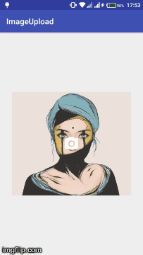

# volley-image-upload
Android Image Upload Using Volley Library 
Implements the following libraries
<dl>
	<dt><a href="https://github.com/google/volley" target="_blank">Volley Library</a></dt>
	<dd>Perform HTTP Requests Asynchronously</dd>
	<dt><a href="https://github.com/square/picasso" target="_blank">Picasso Library</a></dt>
	<dd>Load Images From URL or File to ImageView</dd>
	<dt><a href="https://github.com/ArthurHub/Android-Image-Cropper" target="_blank">Android Image Cropper</a></dt>
	<dd>Crop Selected Image to Square Images</dd>
	<dt><a href="https://github.com/zetbaitsu/Compressor" target="_blank">Compressor</a></dt>
	<dd>Compress Selected Image for Efficient Data Usage on Upload(Check library for compression quality)</dd>
</dl> 
<h4>Demo</h4> 
 

ImageView placeholder image source

	<a href="https://www.behance.net/yuschav">Yuschav Arly</a> 
	<a href="https://www.artstation.com/kallela32">Andy Kallela</a>
